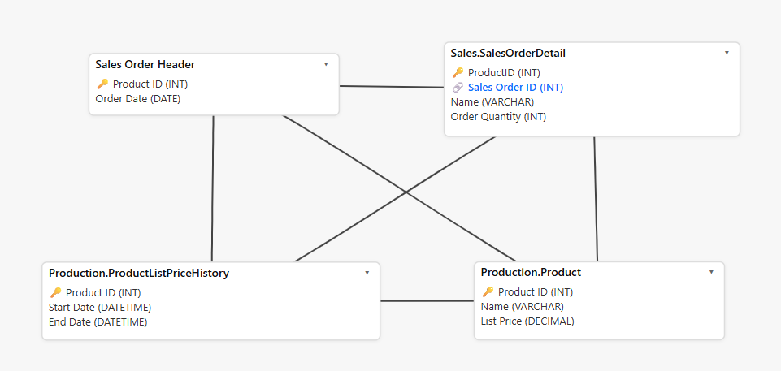

## Project Background
  Adventure Works Cycles, a global bicycle manufacturer specializing in bikes, components, and accessories, recently identified a profitability issue with one of its historically strong products being the LL Road Frame–Black 60. Despite the model’s reputation and consistent demand in prior years, sales declined and margins tightened. Leadership requested an investigation into potential causes driving the weak performance.

  To understand the issue, the analysis focused on production and sales‑related variables like total sales, list price, order dates, and unit price. Using the AdventureWorks2017 database, SQL queries, temporary tables, and stored procedures were created to isolate trends, compare product variations, and evaluate pricing behavior over time. This structured approach made it possible to break down the problem and identify the factors contributing to the LL Road Frame–Black 60’s declining performance.

## Data Structure

  

  The ERD above shows the core tables used in this analysis and how product, pricing history, and sales data are connected through shared keys like ProductID and SalesOrderID. These tables served as the foundation for creating temporary tables that helped compare product performance and analyze pricing and discount history.

- Sales Order Header: Provided order dates needed to analyze product performance within specific time periods.
- Sales Order Detail: Captured line‑item data such as ProductID, quantity, and unit price for each sale.
- Product List Price History: Tracked historical list price changes to evaluate pricing and discount trends.
- Product: Stored core product attributes used to link sales and pricing data back to each item.

##  Executive Summary 
  The LL Road Frame–Black 60 experienced a decline in sales and profitability driven by a combination of higher production costs, lack of promotional activity, and variation in customer preference across size and color combinations.

  Although the model maintained a stable list price, internal cost differences between the black and red variations significantly impacted margins. Additionally, incomplete customer feedback data limited the ability to fully understand buying motivations, leaving potential demand‑related factors unexplored.

  Overall, the analysis suggests that the LL Road Frame–Black 60’s performance issues stem from operational cost inefficiencies and product‑level preference trends rather than external market shifts or pricing strategy failures.

## Insights Deep Dive
### 1. Cost Variance Between Color Models
  One of the most impactful findings was the 8% higher standard cost associated with producing the black frame models compared to the red versions. While customers paid the same price regardless of color, the increased production cost directly reduced profit margins. For example, on 7/31/2013, the company sold 27 units of the LL Road Frame–Black 60. Revenue remained consistent with expectations, but profit was noticeably lower due to the elevated cost of goods sold. This pattern repeated across multiple sales periods.

### 2. Variation in Customer Preference
  Analysis of the “Sales by Size and Color” table revealed substantial differences in quantity sold across color variations for the same size. Some colors consistently outperformed others, suggesting that customer preference plays a meaningful role in demand for specific frames. The LL Road Frame–Black 60 showed weaker performance relative to its red counterpart, indicating that color preference may be contributing to the decline in sales volume.

### 3. Limited Promotional Activity
  Historical pricing data showed minimal discounting or promotional adjustments for the LL Road Frame–Black 60. While stable pricing can signal product strength, it may also reduce competitiveness if customer interest shifts toward alternative models or color variations.

### 4. Data Limitations
  The AdventureWorks2017 database contains incomplete and occasionally inaccurate data. Missing “buying reason” fields for the LL Road Frame models limited the ability to understand customer motivations. There were also some inconsistencies in sales quantities and prices noted throughout the analysis. These limitations do not invalidate the findings, but they do highlight areas where better data collection and accuracy would strengthen future decision‑making.

## Recommendations
### 1. Improve Customer Feedback Collection
  Enhancing the completeness and accuracy of customer feedback especially around buying reasons and product preferences. This would provide clearer insight into why certain color and size combinations underperform.

### 2. Investigate and Reduce Production Costs
  The 8% higher standard cost for black frames is a direct contributor to reduced profitability. A deeper operational review should be conducted to determine whether:
  - Material costs differ significantly,
  - Production processes vary between color models,
  - Supplier pricing or inefficiencies are driving the cost gap.
Reducing this variance would immediately improve margins.

### 3. Evaluate Promotional Strategy
  Introducing targeted promotions or discounts for underperforming color/size combinations could help stimulate demand and improve inventory turnover.

### 4. Expand Product Variation Analysis
  Given the strong differences in performance across colors and sizes, leadership should consider:
- Adjusting production volume to align with customer preference trends.
- Conducting A/B pricing or promotional experiments.
